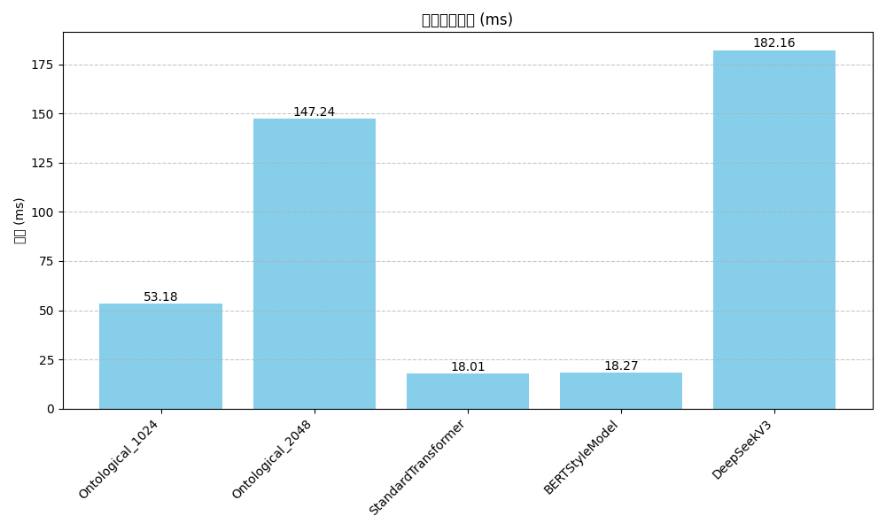
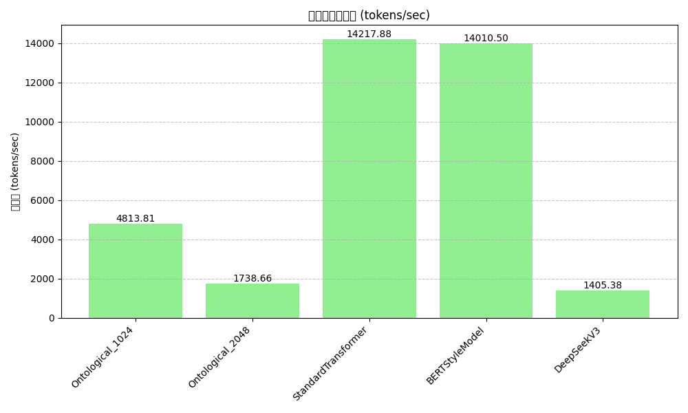
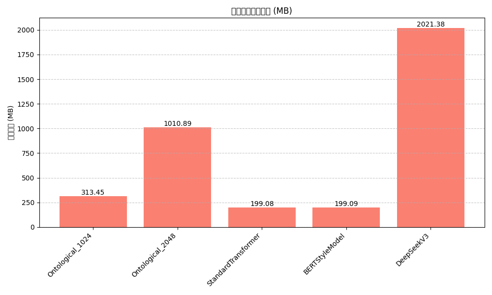
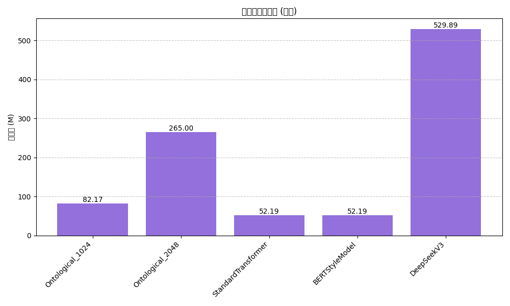
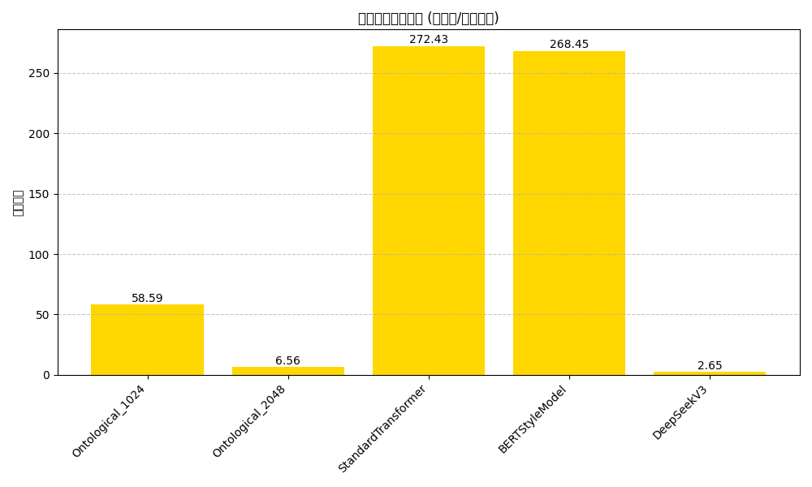

# 模型性能测试报告

**测试日期:** 2025-04-02 20:39:45
**测试设备:** cpu

## 性能摘要

- 延迟最低模型: **StandardTransformer**
- 吞吐量最高模型: **StandardTransformer**
- 内存使用最少模型: **StandardTransformer**
- 参数效率最高模型: **StandardTransformer**

## 详细性能数据

### 推理性能

| 模型 | 参数量 | 延迟 (ms) | 吞吐量 (tokens/sec) | 内存使用 (MB) | 参数效率 |
|------|--------|-----------|---------------------|---------------|----------|
| Ontological_1024 | 82,167,810 | 53.18 | 4813.81 | 313.45 | 58.59 |
| Ontological_2048 | 264,998,914 | 147.24 | 1738.66 | 1010.89 | 6.56 |
| StandardTransformer | 52,188,674 | 18.01 | 14217.88 | 199.08 | 272.43 |
| BERTStyleModel | 52,190,210 | 18.27 | 14010.50 | 199.09 | 268.45 |
| DeepSeekV3 | 529,891,330 | 182.16 | 1405.38 | 2021.38 | 2.65 |

## 图表

### Latency 对比

### Throughput 对比

### Memory 对比

### Parameters 对比

### Efficiency 对比

## 结论

### 性能分析

**宇宙本体模型表现:**

**隐藏层大小的影响:**

- 较小的隐藏层维度(1024)提供了更低的延迟
- 较小的隐藏层维度(1024)实现了更高的吞吐量
- 较小的隐藏层维度(1024)展示了更高的参数效率

**DeepSeek V3与其他模型对比:**

- DeepSeek V3模型延迟表现**不如其他所有模型**
- DeepSeek V3模型吞吐量表现**不如其他所有模型**

### 总体结论

- **模型架构比较**：
  - 宇宙本体模型平均延迟: 100.21 ms
  - 标准Transformer延迟: 18.01 ms
  - BERT风格模型延迟: 18.27 ms

- **模型选择建议**：
  - 对延迟敏感的应用：选择 StandardTransformer
  - 高吞吐量需求：选择 StandardTransformer
  - 内存受限环境：选择 StandardTransformer
  - 参数效率优先：选择 StandardTransformer
